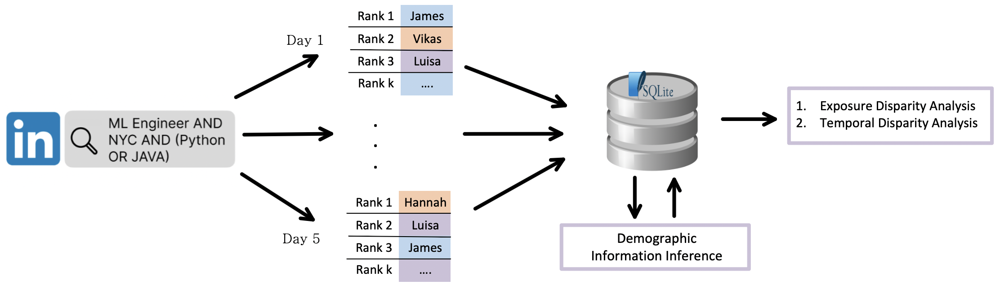

# An External Fairness Evaluation of LinkedIn Talent Search

**Tina Behzad, Siddartha Devic, Vatsal Sharan, Aleksandra Korolova, David Kempe**

---

  
*Figure: Overview of the fairness audit pipeline*  

---

## Abstract

We conduct an independent, third-party audit for bias in LinkedIn’s Talent Search ranking system, focusing on potential ranking bias across two attributes: gender and race. To do so, we first construct a dataset of rankings produced by the system, collecting extensive Talent Search results across a diverse set of occupational queries. We then develop a robust labeling pipeline that infers the two demographic attributes of interest for the returned users.

To evaluate potential biases in the collected dataset of real-world rankings, we utilize two exposure disparity metrics: deviation from group proportions and MinSkew@k. Our analysis reveals an under-representation of minority groups in early ranks across many queries. We further examine potential causes of this disparity, and discuss why they may be difficult or, in some cases, impossible to fully eliminate among the early ranks of queries.

Beyond static metrics, we also investigate the concept of subgroup fairness over time, highlighting temporal disparities in exposure and retention, which are often more difficult to audit for in practice. In employer recruiting platforms such as LinkedIn Talent Search, the persistence of a particular candidate over multiple days in the ranking can directly impact the probability that the given candidate is selected for opportunities. Our analysis reveals demographic disparities in this temporal stability, with some groups experiencing greater volatility in their ranked positions than others.

We contextualize all our findings alongside LinkedIn’s published self-audits of its Talent Search system and reflect on the methodological constraints of a black-box external evaluation, including limited observability and noisy demographic inference. Our work contributes empirical insights and practical guidance for conducting third-party audits of modern socio-technical systems that go beyond the well-studied and standard algorithmic fairness guarantees of predictors.

---

## Repository Structure

This repository contains the analysis code and data-processing scripts used in the study:

- `data_collection.py`  
  Collects and stores LinkedIn Talent Search results for a set of occupational queries.

- `data_cleaning.py`  
  Cleans and standardizes raw candidate data, handling missing fields and normalizing formats.

- `full_plots.py`  
  Generates the full suite of analysis plots, including heatmaps, skew@k plots, and temporal churn visualizations.

- `statistical_tests.py`  
  Conducts statistical tests to validate the significance of disparities across groups and time.

- `src/`  
  Additional utilities, helper functions, or reusable modules that support the main analysis pipeline.

---

## Citation

If you use this code or findings from the paper, please cite us. 

[//]: # (```bibtex)

[//]: # (@inproceedings{behzad2025linkedin,)

[//]: # (  title={An External Fairness Evaluation of LinkedIn Talent Search},)

[//]: # (  author={Behzad, Tina and Devic, Siddartha and Sharan, Vatsal and Korolova, Aleksandra and Kempe, David},)

[//]: # (  booktitle={Proceedings of the AAAI Conference on Artificial Intelligence &#40;AAAI&#41;},)

[//]: # (  year={2025})

[//]: # (})
